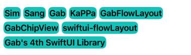

# swiftui-flowLayout


### Requirements
* iOS 14.0+
* Xcode 12.0+
* Swift 5.3


### Content
* [Documentation](#documentation)
* [FlowLayout](#flowLayout)


<a name="documentation"></a>
# Documentation

SwiftUI에서 ChipView를 구현하기 위해선 Apple에서 iOS 16이상에서 제공해주는 Layout을 사용하면 간단하게 구현이 가능합니다.   
하지만 실제로 앱을 서비스 할 때 iOS 16미만의 사용자들도 많기 때문에 iOS 14이상부터 사용 가능한 ChipView, FlowLayout을 소개합니다!


<a name="flowLayout"></a>
# FlowLayout

### Usage example:

```
    var list: [String] = [
        "Sim",
        "Sang",
        "Gab",
        "KaPPa",
        "GabFlowLayout",
        "GabChipView",
        "swiftui-flowLayout",
        "Gab's 4th SwiftUI Library"
    ]
    
    var body: some View {
        FlowLayoutView(.horizontal) {
            ForEach(list, id: \.self) { string in
                Text(string)
                    .font(.headline)
                    .padding(.all, 2)
                    .background(.mint)
                    .cornerRadius(8)
            }
        }
        .configurationSpacing(line: 5, item: 5)
        .padding(.all, 10)
    }
```


