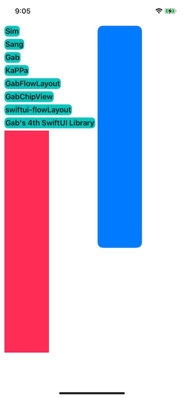
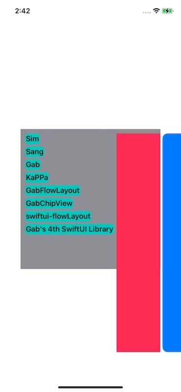

# swiftui-flowLayout


### Requirements
* iOS 14.0+
* Xcode 12.0+
* Swift 5.3


### Content
* [Documentation](#documentation)
* [FlowLayout](#flowLayout)
  * [Axis](#axis)
    * [Horizontal](#horizontal)
    * [Vertical](#vertical)
* [Modifier](#modifier)
  * [configurationSpacing](#configurationSpacing)
  * [layoutMode](#layoutMode)

<a name="documentation"></a>
# Documentation

SwiftUI에서 ChipView를 구현하기 위해선 Apple에서 iOS 16이상에서 제공해주는 Layout을 사용하면 간단하게 구현이 가능합니다.   
하지만 실제로 앱을 서비스 할 때 iOS 16미만의 사용자들도 많기 때문에 iOS 14이상부터 사용 가능한 ChipView, FlowLayout을 소개합니다!


<a name="flowLayout"></a>
# FlowLayout


<a name="axis"></a>
### Axis

<a name="horizontal"></a>
* `Horizontal`

    ##### Usage example:
    ```swift
    import GabFlowLayout
    
        var list: [String] = [
            "Sim",
            "Sang",
            "Gab",
            "KaPPa",
            "GabFlowLayout",
            "GabChipView",
            "swiftui-flowLayout",
            "Gab's 4th SwiftUI Library"
        ]
        
        var body: some View {
            FlowLayoutView(.horizontal) {
                ForEach(list, id: \.self) { string in
                    Text(string)
                        .font(.headline)
                        .padding(.all, 2)
                        .background(.mint)
                        .cornerRadius(8)
                }
            
                Rectangle()
                    .fill(.pink)
                    .frame(width: 300, height: 100)
                
                RoundedRectangle(cornerRadius: 12)
                    .fill(.blue)
                    .frame(width: 350, height: 150)
            }
            .configurationSpacing(line: 5, item: 5)
            .padding(.all, 10)
        }
    ```
    
    


<a name="vertical"></a>
* `Vertical`

  ##### Usage example:
    ```swift
    import GabFlowLayout
    
        var list: [String] = [
            "Sim",
            "Sang",
            "Gab",
            "KaPPa",
            "GabFlowLayout",
            "GabChipView",
            "swiftui-flowLayout",
            "Gab's 4th SwiftUI Library"
        ]
        
        var body: some View {
            FlowLayoutView(.vertical) {
                ForEach(list, id: \.self) { string in
                        Text(string)
                            .font(.headline)
                            .padding(.all, 2)
                            .background(.mint)
                            .cornerRadius(8)
                    }
                
                Rectangle()
                    .fill(.pink)
                    .frame(width: 100, height: 500)
                
                RoundedRectangle(cornerRadius: 12)
                    .fill(.blue)
                    .frame(width: 100, height: 500)
            }
            .configurationSpacing(line: 5, item: 5)
            .padding(.all, 10)
        }
    ```
    
    


<a name="Modifier"></a>
# Modifier

<a name="configurationSpacing"></a>
* `func configurationSpacing(line: CGFloat = .zero, item: CGFloat = .zero) -> FlowLayoutView`
  
   View들에 spacing을 적용시켜준다.   

   horziontal은 가로로 배치되기 때문에 각 View들의 가로 spacing은 item에 의해 적용, 세로 spacing은 line에 의해 적용된다.
  
   vertical은 세로로 배치되기 때문에 각 View들의 세로 spacing은 item에 의해 적용, 가로 spacing은 line에 의해 적용된다.
   
   | axis | 가로 spacing | 세로 spacing |
   |:---------------------:|:------------------:|:---------:|
   | **`horizontal`** | item | line |
   | **`vertical`** | line | item |


<a name="layoutMode"></a>
* `func layoutMode(_ mode: FlowLayoutMode) -> FlowLayoutView`

FlowLayoutView를 구성할 때, frame을 지정안한경우 기본적으로 GeomtryReader에 의해   
ZStack에 frame의 maxWidth, maxHeight을 `.infinity`로 준 것과 같은 공간을 차지합니다.

근데 여기서 해당 flowLayout을 구성하는 방식은 alignmentGuide을 이용해서 View들을 배치하기 때문에 FlowLayoutView에 frame을 지정했는데,   
만약 여기서 child View들의 크기가 부모의 frame보다 커버린 경우, 부모의 View를 뚫고 배치가 됩니다.




